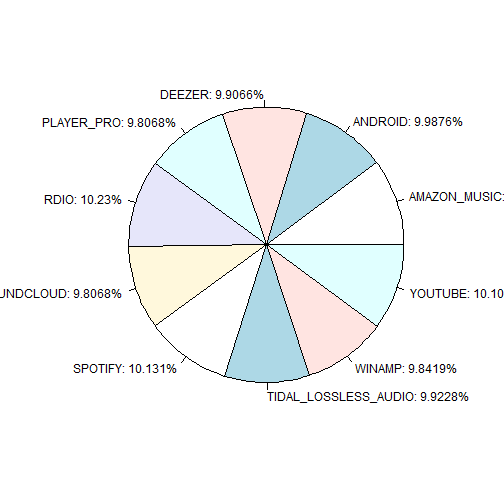
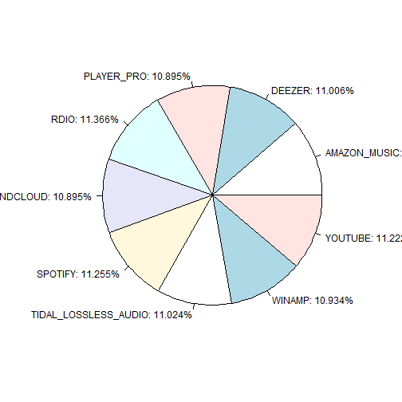
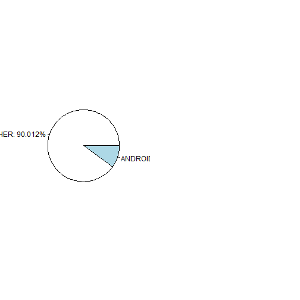

Soundwave Project
========================================================
author: Joao Bosco Jares
date: 18/05/2015


Abstract
========================================================
This project starts a first step guide to dig into the music world based on fictitious data from soundwave. for this purpose the data was generated using an unique "seed". Based on project text "1 million user records, 175 million plays and 240 million operations spanning two years". So, this document tries to explain the approach, results and conclusions, of the related hypothesis through some evidences based on the comparison of played sounds between stream and non-stream services.


Results - Question 1
========================================================
Show how would you gather and model Soundwave data to build a case that supports  or refutes the streaming service's position from a Soundwave perspective. Consider  Android users only. Note that when an MP3 file or similar is played, the source.name  field of a play is Android  otherwise, it is equal to the name of the streaming service,  e.g. Spotify.  

Reply: This document, as well as, the previous version (now used as support paper), tries to show on low level how I gather and model Soundwave data to build a case that supports.


Results - Question 2 (1/3)
========================================================
Can you extend your conclusions to the mobile music listening population in general?  If not, why not. If so, how? 

Reply: 
1) I Used the hypothesis below, extracted from the project text, that says: "Music streaming services such as Spotify and Tidal claim publicly that they are capturing  market share from traditional file based services such as iTunes and 7Digital, or personal CD  rips.  Furthermore, they claim the pace of this change is gathering speed."

Results - Question 2 (2/3)
========================================================
2) I asserted that all source.name different then "ANDROID" is one stream service, as well as, each one named "ANDROID" can be other kind of music service (called as non-stream service, in this paper), you can find the extracted text as follow: "Consider  Android users only. Note that when an MP3 file or similar is played, the source.name  field of a play is Android  otherwise, it is equal to the name of the streaming service,  e.g. Spotify.  "

Results - Question 2 (3/3.a)
========================================================
3) The answer is: YES. based on the fake data used to analyse the music market share behavior, on the last two years. But, one important point to pay attention is about how long this wave could take until other fashion wave happen, may be a new kind of music stream, share or buy. We can't ignore that the iTunes, 7digital, and other has a lot time on the market and they're tuned in this behavior, probably expending a lot of money on research to find the workaround path, or even to buy great startups on same segment.
Well, other, important points to pay attention and/or take as hypothesis is:
a) Internet security, once the user probably will choose the most security plataform.

Results - Question 2 (3/3.b)
========================================================
b) The brand power, how much the brand can influence a target public, as well as, Where is this public, who is?

Results - Question 2 (3/3.c)
========================================================
c) Many artists are emerging on music scenario while other are loosing space. Who hold the songs rights? The correct song rights, on the correct place, with the correct target public, could be a mine of gold.

Results - Question 2 (3/3.d)
========================================================
d) Many other variables must emerge, and probably more different kind of data could be necessary to make a better analyse. 
For instace, if we can define the musical genre, based on a age range, location, as well as, other existent data on soundwave database, it could be merged with a collection of data that regards the factors that most define new music tendencies. We'll can enhance our songs suggestions.


Results - Question 3
========================================================
3) We have a sense that any evidence compiled will vary widely by region. Given the  location information associated with a play, discuss how you might break down your  evidence by region.  

Reply: I completely agree. based on the arguments explained above.
Related the breakdown way. The first part was done, when I extracted the related data from itunes page, as well as, when I gathered the geo location from google api to fill the soundwave PLAY Action model.
So, With this data on hands, we can use many technical to brake and merge to model other meanings. Just using R I can suggest subset, dplyr, k-means, and many other approachs even using python or Java, if necessary.

Code / Data 
========================================================
All the content below tries to show, using a reproducible context, all the steps related to gathering and model data to support this thesis. In bottom, the last section point to reference links, including the previous paper.


Non-Automated Part - clone project
========================================================
- JAVA and Maven3 must be pre-installed.
- To start, you need to clone the support java project from github, as URL to the video below: 
https://drive.google.com/file/d/0By2jTQ9xDwq-b0dQMFE2YWxydHc/view?usp=sharing


Automated Part - Build and Install rJava - Part 1
========================================================
- You probably have copied the jsw project folder path. If yes, it's time to use it :)
So, use the code below to start the integration process.

```r
source("javaCompileAndPackageToRFolder.R")
```

Automated Part - Build and Install rJava - Part 2
========================================================
- After, you have started this process, some questions will be made by the system.
- The first question is regards the JAVA_HOME folder path. If you just press enter the system will input the folder path of my own installation (not seems good). So, inform the correct path and don't worry. The question seems as below:

```
If your JAVA_HOME is different from that 
 C:/Program Files/Java/jdk1.7.0_71/jre, please input below, else press enter:
```

Automated Part - Build and Install rJava - Part 3
========================================================
- The second question is regards the cloned project folder path. If you just press enter the system will input the folder path of my own installation (not seems good). So, inform the correct path (just copy and paste) don't worry. The question seems as below:


```
Please, inform the cloned project location:
```

Automated Part - Build and Install rJava - Part 4
========================================================
- Now, your r environment should contains the generated .jar, named "MassGen-0.0.1-SNAPSHOT.jar", as well as, a lib folder with all his dependencies. Why you don't take a look?
- Is there? Great!!!


Automated Part - Extract Data - Part 1
========================================================
- We did all these steps, because I believe that Java is more productive than R to this kind of job. No problem if I'm wrong. If I'm I'll learn, and say you ASAP :)

- Ok. And now? We'll use the support java code. First, you need to import using source the javaCompileAndPackageToRFolder.R, as below:

```r
source("ExtractAndGenMass.R")
```
- Why this file starts with an uppercase letter? I'm using this pattern for classes and lowercase to start a script name (needs some code refactoring soon).

Automated Part - Extract Data - Part 2
========================================================
- This class makes reference to the four scripts who call the java methods properly. Extracting and generating each necessary file to integrate our first full dataset.
- You can take a look in this interesting class, who has four methods, all of them are called by the class in the final lines, as below:


```r
ExtractMass$codeAndCountyExtract()
ExtractMass$basicDataExtract()
ExtractMass$geoLocDataExtract()
ExtractMass$playGen()
```

Automated Part - Extract Data - Part 3
========================================================
- Goes to itunes sales site, main page, then extract all country's code to retrieve his content.

```r
ExtractMass$codeAndCountyExtract()
```

Automated Part - Extract Data - Part 4
========================================================
- Goes to itunes sales site, and using the gathered data on the first process, uses each gathered code to retrieves the data by country.

```r
ExtractMass$basicDataExtract()
```

Automated Part - Extract Data - Part 5
========================================================
- Uses the country names retrieved for the second script and calls "Google Geocoding" to gather latitude and longitude for each related country.

```r
ExtractMass$geoLocDataExtract()
```

Automated Part - Extract Data - Part 6
========================================================
-The last method is resposible for assembly all gathered data into "Play Action" object then save it on mongoDB.

```r
ExtractMass$playGen()
```

Automated Part - Extract Data - Part 7
========================================================
- It's important to say that each method makes questions regards if you want to update or not the existing file, once for each call (less for the last one), one .csv file is generated into R workspace. As well as, is good to know that the call order matters are important, once each script depends of the data gathered by the previous one.
- In the final, you must have iTunesCodesAndCountries.csv, geoLoc.csv, and basicData.csv into your workspace. Perhaps them can be moved for a properly data warehouse, once all the interaction will be interfacing with mongo after the last method call. So, they maybe can called as temp files.


Main classes cover
========================================================
- We have a huge topic related to code organization, or disorganization :) But, Is necessary to point that after this moment we'll interact more with swDAO.R and presentationView.R classes to start our generation's work. Just a brief, the first class take care of the mongo access and the second one deal with graphic methods.
Ps.: All of them uses the global.R script to initialize libraries, define constants, create cache variables, as well as, other utilities. Please, feel free to take a look on the repository at https://github.com/jbjares/rsw.git


Creating our data.frame base on the memory
========================================================


```r
source("global.R")
source("swDAO.R")

cursor<<- DAO$findAllObsUnderPlayCollection()
fullDF<<- DAO$convertCursorToDataFrame(cursor) 
```

OR


```r
source("presentationView.R")
```


Applying nrow function on our newest dataset
========================================================
- nrow

```r
source("presentationView.R")
nrow(fullDF)
```

```
[1] 37056
```
Annual average access averaged over the period 2013 through 2014
========================================================

Applying head function on our newest dataset
========================================================
- head

```r
library(xtable)
source("presentationView.R")
xt <- xtable(head(fullDF))
print(xt, type="html")
```

<!-- html table generated in R 3.1.3 by xtable 1.7-4 package -->
<!-- Tue May 19 02:57:16 2015 -->
<table border=1>
<tr> <th>  </th> <th> ID </th> <th> COL_NAME </th> <th> PLAY_DATE </th> <th> TITLE </th> <th> ARTIST </th> <th> ACCESS_DATE </th> <th> PLATAFORM </th> <th> SOURCE_NAME </th> <th> DEVICE </th> <th> BACKGROUNDED </th> <th> AUTOPLAY </th> <th> LNG </th> <th> LAT </th> <th> COUNTRY </th> <th> USER_ID </th> <th> ACTION_TYPE </th>  </tr>
  <tr> <td align="right"> 1 </td> <td> 554e97dbeb35a42b8c76e78a </td> <td> com.soundwave.model.playaction.Play </td> <td> 2013-11-25T00:27:22.881Z </td> <td> Get Lucky (feat. Pharrell Williams &amp; Nile Rodgers) </td> <td> Daft Punk </td> <td> 2013-11-25T00:27:22.881Z </td> <td> Android x.x.3 </td> <td> YOUTUBE </td> <td> XYZ v_3 </td> <td> FALSE </td> <td> FALSE </td> <td> -64.639968 </td> <td> 18.420695 </td> <td> British Virgin Islands </td> <td> e8ffc9af-c113-4998-9d4f-e5edf60330dd </td> <td> PLAY </td> </tr>
  <tr> <td align="right"> 2 </td> <td> 554e97dbeb35a42b8c76e78b </td> <td> com.soundwave.model.playaction.Play </td> <td> 2013-09-12T00:27:23.401Z </td> <td> Girl On Fire (feat. Nicki Minaj) [Inferno Version] </td> <td> Cœur de pirate </td> <td> 2013-09-12T00:27:23.401Z </td> <td> Android x.x.4 </td> <td> SOUNDCLOUD </td> <td> XYZ v_4 </td> <td> TRUE </td> <td> TRUE </td> <td> 114.727669 </td> <td> 4.535277 </td> <td> Brunei </td> <td> 864d0845-1462-4ccd-8eec-c02a873eeb30 </td> <td> PLAY </td> </tr>
  <tr> <td align="right"> 3 </td> <td> 554e97dbeb35a42b8c76e78c </td> <td> com.soundwave.model.playaction.Play </td> <td> 2014-02-09T00:27:23.492Z </td> <td> Love Me Like You Do (From The "Fifty Shades Of Grey" Soundtrack) </td> <td> Sam Smith </td> <td> 2014-02-09T00:27:23.492Z </td> <td> Android x.x.0 </td> <td> ANDROID </td> <td> XYZ v_0 </td> <td> FALSE </td> <td> TRUE </td> <td> -77.39627999999999 </td> <td> 25.03428 </td> <td> Bahamas </td> <td> 95a60975-7210-49d2-b3b3-8d00141a95d2 </td> <td> PLAY </td> </tr>
  <tr> <td align="right"> 4 </td> <td> 554e97dbeb35a42b8c76e78d </td> <td> com.soundwave.model.playaction.Play </td> <td> 2013-07-18T00:27:23.581Z </td> <td> Una Cita </td> <td> Usher &amp; Alicia Keys </td> <td> 2013-07-18T00:27:23.581Z </td> <td> Android x.x.1 </td> <td> RDIO </td> <td> XYZ v_1 </td> <td> FALSE </td> <td> TRUE </td> <td> LNG </td> <td> LAT </td> <td> COUNTRY </td> <td> 1b86be97-2e78-4f90-8f73-53704976f530 </td> <td> PLAY </td> </tr>
  <tr> <td align="right"> 5 </td> <td> 554e97dbeb35a42b8c76e78e </td> <td> com.soundwave.model.playaction.Play </td> <td> 2014-03-23T00:27:23.637Z </td> <td> Fireball (feat. John Ryan) </td> <td> Jessie J, Ariana Grande &amp; Nicki Minaj </td> <td> 2014-03-23T00:27:23.637Z </td> <td> Android x.x.1 </td> <td> RDIO </td> <td> XYZ v_1 </td> <td> TRUE </td> <td> TRUE </td> <td> -86.241905 </td> <td> 15.199999 </td> <td> Honduras </td> <td> 0c01affc-6491-42dc-bd62-5a5ec86cc0bd </td> <td> PLAY </td> </tr>
  <tr> <td align="right"> 6 </td> <td> 554e97dbeb35a42b8c76e78f </td> <td> com.soundwave.model.playaction.Play </td> <td> 2013-10-21T00:27:23.694Z </td> <td> Llegaste Tú (feat. Juan Luis Guerra) </td> <td> Warren G </td> <td> 2013-10-21T00:27:23.694Z </td> <td> Android x.x.3 </td> <td> YOUTUBE </td> <td> XYZ v_3 </td> <td> FALSE </td> <td> TRUE </td> <td> -102.552784 </td> <td> 23.634501 </td> <td> Mexico </td> <td> 6862f3cd-b307-43a2-9e26-eab6c37e0f13 </td> <td> PLAY </td> </tr>
   </table>

Applying tail function on our newest dataset
========================================================
- tail

```r
library(xtable)
source("presentationView.R")
xt <- xtable(tail(fullDF))
print(xt, type="html")
```

<!-- html table generated in R 3.1.3 by xtable 1.7-4 package -->
<!-- Tue May 19 02:57:52 2015 -->
<table border=1>
<tr> <th>  </th> <th> ID </th> <th> COL_NAME </th> <th> PLAY_DATE </th> <th> TITLE </th> <th> ARTIST </th> <th> ACCESS_DATE </th> <th> PLATAFORM </th> <th> SOURCE_NAME </th> <th> DEVICE </th> <th> BACKGROUNDED </th> <th> AUTOPLAY </th> <th> LNG </th> <th> LAT </th> <th> COUNTRY </th> <th> USER_ID </th> <th> ACTION_TYPE </th>  </tr>
  <tr> <td align="right"> 37051 </td> <td> 555694d567180e09b405dfc1 </td> <td> com.soundwave.model.playaction.Play </td> <td> 2014-03-29T01:52:37.063Z </td> <td> So Freakin' Tight </td> <td> Jordin Sparks </td> <td> 2014-03-29T01:52:37.063Z </td> <td> Android x.x.1 </td> <td> RDIO </td> <td> XYZ v_1 </td> <td> FALSE </td> <td> TRUE </td> <td> 21.824312 </td> <td> 39.074208 </td> <td> Greece </td> <td> ee80ea00-6b48-4340-828b-822952f3e5bb </td> <td> PLAY </td> </tr>
  <tr> <td align="right"> 37052 </td> <td> 555694d567180e09b405dfc2 </td> <td> com.soundwave.model.playaction.Play </td> <td> 2014-03-15T01:52:37.065Z </td> <td> I Bet </td> <td> DJ Khaled </td> <td> 2014-03-15T01:52:37.065Z </td> <td> Android x.x.5 </td> <td> DEEZER </td> <td> XYZ v_5 </td> <td> TRUE </td> <td> FALSE </td> <td> 5.291265999999999 </td> <td> 52.132633 </td> <td> Netherlands </td> <td> 55c51eb0-2621-4b13-b792-776c669089c3 </td> <td> PLAY </td> </tr>
  <tr> <td align="right"> 37053 </td> <td> 555694d567180e09b405dfc3 </td> <td> com.soundwave.model.playaction.Play </td> <td> 2014-01-22T01:52:37.068Z </td> <td> Bloodstream </td> <td> Machel Montano </td> <td> 2014-01-22T01:52:37.068Z </td> <td> Android x.x.9 </td> <td> TIDAL_LOSSLESS_AUDIO </td> <td> XYZ v_9 </td> <td> TRUE </td> <td> TRUE </td> <td> 28.369885 </td> <td> 47.411631 </td> <td> Moldova </td> <td> 33206593-8b61-427d-9981-d282bfdee3df </td> <td> PLAY </td> </tr>
  <tr> <td align="right"> 37054 </td> <td> 555694d567180e09b405dfc4 </td> <td> com.soundwave.model.playaction.Play </td> <td> 2013-05-22T01:52:37.071Z </td> <td> #Jetsgo </td> <td> Sia </td> <td> 2013-05-22T01:52:37.071Z </td> <td> Android x.x.0 </td> <td> ANDROID </td> <td> XYZ v_0 </td> <td> TRUE </td> <td> FALSE </td> <td> 104.990963 </td> <td> 12.565679 </td> <td> Cambodia </td> <td> 2cf69d54-a2b2-4524-9673-ad4dacb90cd8 </td> <td> PLAY </td> </tr>
  <tr> <td align="right"> 37055 </td> <td> 555694d567180e09b405dfc5 </td> <td> com.soundwave.model.playaction.Play </td> <td> 2014-03-30T02:52:37.073Z </td> <td> Trampoline </td> <td> Sinach </td> <td> 2014-03-30T02:52:37.073Z </td> <td> Android x.x.3 </td> <td> YOUTUBE </td> <td> XYZ v_3 </td> <td> TRUE </td> <td> TRUE </td> <td> -77.39627999999999 </td> <td> 25.03428 </td> <td> Bahamas </td> <td> ce6f1b8d-70cd-4e99-ba2a-5d75cd5c0083 </td> <td> PLAY </td> </tr>
  <tr> <td align="right"> 37056 </td> <td> 555694d567180e09b405dfc6 </td> <td> com.soundwave.model.playaction.Play </td> <td> 2014-01-23T01:52:37.076Z </td> <td> I Know Who I Am </td> <td> A$AP Rocky </td> <td> 2014-01-23T01:52:37.076Z </td> <td> Android x.x.2 </td> <td> SPOTIFY </td> <td> XYZ v_2 </td> <td> FALSE </td> <td> TRUE </td> <td> -61.796428 </td> <td> 17.060816 </td> <td> Antigua and Barbuda </td> <td> 3f44b68d-a137-4352-8b17-fdde7aabe7a4 </td> <td> PLAY </td> </tr>
   </table>


Applying unique/country name function on our newest dataset
========================================================
- unique/country

```r
source("presentationView.R")
unique(fullDF$COUNTRY)
```

```
 [1] "British Virgin Islands" "Brunei"                
 [3] "Bahamas"                "COUNTRY"               
 [5] "Honduras"               "Mexico"                
 [7] "Argentina"              "Burkina-Faso"          
 [9] "Namibia"                "Bolivia"               
[11] "Qatar"                  "Belize"                
[13] "Malta"                  "Guatemala"             
[15] "Gambia"                 "Venezuela"             
[17] "Poland"                 "UAE"                   
[19] "Mozambique"             "Turkey"                
[21] "Mongolia"               "Ukraine"               
[23] "Philippines"            "Antigua and Barbuda"   
[25] "Guinea-Bissau"          "Canada"                
[27] "Thailand"               "Belarus"               
[29] "Finland"                "Uganda"                
[31] "Estonia"                "Macau"                 
[33] "Portugal"               "Turkmenistan"          
[35] "Bahrain"                "Micronesia"            
[37] "Grenada"                "Anguilla"              
[39] "Moldova"                "Bermuda"               
[41] "Cambodia"               "Trinidad and Tobago"   
[43] "Russia"                 "Azerbaijan"            
[45] "Austria"                "Mauritius"             
[47] "Singapore"              "Vietnam"               
[49] "France"                 "Paraguay"              
[51] "Fiji"                   "Saint Kitts and Nevis" 
[53] "Zimbabwe"               "Romania"               
[55] "Ghana"                  "Botswana"              
[57] "Australia"              "Greece"                
[59] "Papua New Guinea"       "Netherlands"           
[61] "USA"                    "Nepal"                 
[63] "Germany"                "Uzbekistan"            
[65] "Malaysia"               "UK"                    
[67] "Bulgaria"               "Saudi Arabia"          
[69] "Armenia"                "Brazil"                
[71] "Peru"                  
```


Summarized Accesses Shared By Service's Name - RDIO
========================================================
- RDIO

```r
source("presentationView.R")
Presentation$showSummarizedMarketShareByServiceName(fullDF,"RDIO")
```

```
   Min. 1st Qu.  Median    Mean 3rd Qu.    Max. 
  36.00   49.50   52.00   53.38   57.00   74.00 
```


Summarized Accesses Shared By Service's Name - ANDROID
========================================================
- ANDROID

```r
source("presentationView.R")
Presentation$showSummarizedMarketShareByServiceName(fullDF,"ANDROID")
```

```
   Min. 1st Qu.  Median    Mean 3rd Qu.    Max. 
  39.00   48.00   52.00   52.11   56.00   72.00 
```

Summarized Accesses Shared By Service's Name - SPOTIFY
========================================================
- SPOTIFY

```r
source("presentationView.R")
Presentation$showSummarizedMarketShareByServiceName(fullDF,"SPOTIFY")
```

```
   Min. 1st Qu.  Median    Mean 3rd Qu.    Max. 
  38.00   48.00   51.00   52.85   57.50   69.00 
```

Summarized Accesses Shared By Service's Name - YOUTUBE
========================================================
- YOUTUBE

```r
source("presentationView.R")
Presentation$showSummarizedMarketShareByServiceName(fullDF,"YOUTUBE")
```

```
   Min. 1st Qu.  Median    Mean 3rd Qu.    Max. 
  34.00   48.00   53.00   52.69   59.00   68.00 
```

Summarized Accesses Shared By Service's Name - SOUNDCLOUD
========================================================
- SOUNDCLOUD

```r
source("presentationView.R")
Presentation$showSummarizedMarketShareByServiceName(fullDF,"SOUNDCLOUD")
```

```
   Min. 1st Qu.  Median    Mean 3rd Qu.    Max. 
  32.00   47.50   52.00   51.13   56.00   66.00 
```

Summarized Accesses Shared By Service's Name - DEEZER
========================================================
- DEEZER

```r
source("presentationView.R")
Presentation$showSummarizedMarketShareByServiceName(fullDF,"DEEZER")
```

```
   Min. 1st Qu.  Median    Mean 3rd Qu.    Max. 
  39.00   47.00   52.00   51.68   56.00   66.00 
```

Summarized Accesses Shared By Service's Name - PLAYER_PRO
========================================================
- PLAYER_PRO

```r
source("presentationView.R")
Presentation$showSummarizedMarketShareByServiceName(fullDF,"PLAYER_PRO")
```

```
   Min. 1st Qu.  Median    Mean 3rd Qu.    Max. 
  37.00   45.50   51.00   51.17   56.00   71.00 
```

Summarized Accesses Shared By Service's Name - WINAMP
========================================================
- WINAMP

```r
source("presentationView.R")
Presentation$showSummarizedMarketShareByServiceName(fullDF,"WINAMP")
```

```
   Min. 1st Qu.  Median    Mean 3rd Qu.    Max. 
  36.00   47.00   52.00   51.35   55.50   71.00 
```

Summarized Accesses Shared By Service's Name - AMAZON_MUSIC
========================================================
- AMAZON_MUSIC

```r
source("presentationView.R")
Presentation$showSummarizedMarketShareByServiceName(fullDF,"AMAZON_MUSIC")
```

```
   Min. 1st Qu.  Median    Mean 3rd Qu.    Max. 
  37.00   48.50   54.00   53.49   58.50   74.00 
```

Summarized Accesses Shared By Service's Name - TIDAL
========================================================
- TIDAL

```r
source("presentationView.R")
Presentation$showSummarizedMarketShareByServiceName(fullDF,"TIDAL_LOSSLESS_AUDIO")
```

```
   Min. 1st Qu.  Median    Mean 3rd Qu.    Max. 
  32.00   46.00   52.00   51.79   56.00   69.00 
```

Comparison of accesses number between stream and non-stream services on the past two years
========================================================

1) Stream services accesses - Date / Accesses Number
========================================================

```r
stream <- subset(fullDF, SOURCE_NAME!="ANDROID")
stream_tbl <- tbl_df(stream)
gb <- stream_tbl %>% group_by(PLAY_DATE) %>% tally(sort = TRUE)
print(gb)
```

```
Source: local data frame [33,262 x 2]

                  PLAY_DATE n
1  2013-05-15T09:01:00.117Z 2
2  2013-05-15T23:04:39.049Z 2
3  2013-05-16T20:15:51.745Z 2
4  2013-05-16T22:14:05.888Z 2
5  2013-05-23T20:38:35.357Z 2
6  2013-05-29T20:56:36.008Z 2
7  2013-05-30T08:55:06.329Z 2
8  2013-05-30T22:03:50.239Z 2
9  2013-06-04T22:51:12.456Z 2
10 2013-06-05T22:59:47.353Z 2
..                      ... .
```

2) Non-stream services accesses - Date / Accesses Number
========================================================

```r
stream <- subset(fullDF, SOURCE_NAME=="ANDROID")
stream_tbl <- tbl_df(stream)
gb <- stream_tbl %>% group_by(PLAY_DATE) %>% tally(sort = TRUE)
print(gb)
```

```
Source: local data frame [3,701 x 2]

                  PLAY_DATE n
1  2013-05-15T04:26:57.738Z 1
2  2013-05-15T09:47:29.105Z 1
3  2013-05-15T20:15:51.386Z 1
4  2013-05-15T20:16:23.243Z 1
5  2013-05-15T20:29:30.052Z 1
6  2013-05-15T20:43:35.543Z 1
7  2013-05-15T20:45:58.278Z 1
8  2013-05-15T20:57:40.690Z 1
9  2013-05-15T21:00:15.995Z 1
10 2013-05-15T21:40:12.195Z 1
..                      ... .
```

Comparison of accesses number between stream and non-stream services on the past two years
========================================================

1) Stream services accesses - Total Accesses Number
========================================================

```r
stream <- subset(fullDF, SOURCE_NAME!="ANDROID")
stream_tbl <- tbl_df(stream)
gb <- count(stream_tbl,SOURCE_NAME)
print(gb)
```

```
Source: local data frame [9 x 2]

           SOURCE_NAME    n
1         AMAZON_MUSIC 3804
2               DEEZER 3671
3           PLAYER_PRO 3634
4                 RDIO 3791
5           SOUNDCLOUD 3634
6              SPOTIFY 3754
7 TIDAL_LOSSLESS_AUDIO 3677
8               WINAMP 3647
9              YOUTUBE 3743
```


2) Non-stream services accesses - Total Accesses Number
========================================================

```r
stream2 <- subset(fullDF, SOURCE_NAME=="ANDROID")
stream_tbl2 <- tbl_df(stream2)
gb2 <- count(stream_tbl2,SOURCE_NAME)
print(gb2)
```

```
Source: local data frame [1 x 2]

  SOURCE_NAME    n
1     ANDROID 3701
```


Stream and Non-stream services accesses - Accesses Number in %
========================================================

```r
count <- rle(sort(fullDF$SOURCE_NAME))
x <- count$values
y <- count$lengths
df<-data.frame(x=x,y=y)
pie(y,labels=paste0(x,": ",signif((y/sum(y))*100,5),"%"))
```

 

Stream services accesses - Accesses Number in %
========================================================

```r
streamServices <- subset(fullDF, SOURCE_NAME!="ANDROID")
count <- rle(sort(streamServices$SOURCE_NAME))
x <- count$values
y <- count$lengths
df<-data.frame(x=x,y=y)
pie(y,labels=paste0(x,": ",signif((y/sum(y))*100,5),"%"))
```

 

Non-Stream services accesses - Accesses Number in %
========================================================

```r
Count <- rle(sort(fullDF$SOURCE_NAME=="ANDROID")) 
x <- Count$values 
y <- Count$lengths 
df2<-data.frame(x=x,y=y) 
par(mfcol=c(1,2))
pie(y,labels=paste0(c("OTHER","ANDROID"),": ",signif((y/sum(y))*100,5),"%"))
```

 

Supplementary Materials 
========================================================
Previous paper: https://docs.google.com/document/d/1gthYOdV7g3pHKcXilHfJAbKDQ09n4eVZv3tWHDYCt3I/edit?usp=sharing
Support Data: https://drive.google.com/file/d/0By2jTQ9xDwq-Z1lmUElZMGtsYkU/view?usp=sharing
Clone repository video: https://drive.google.com/file/d/0By2jTQ9xDwq-b0dQMFE2YWxydHc/view?usp=sharing
All support files: https://drive.google.com/folderview?id=0By2jTQ9xDwq-fmIyRXllTTBBQ281UlB6SGxXZmJDX0V5WFFvMXZIcld2VTcxZDZCeWxBd00&usp=sharing


Thank you very much for the expend time. 
========================================================
:)

